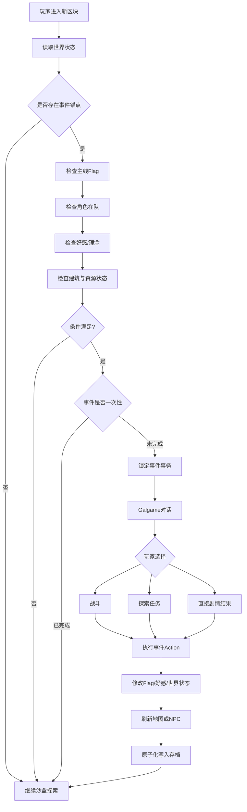

# 《星壤：余辉纪元》——面向 Codex 与 Image Gen 自动生产的二次元二维沙盒游戏设计与提示词体系

## 执行摘要

本报告建议将项目定义为一款**原创的“二次元角色驱动叙事 + 二维可破坏沙盒 + 策略立绘战斗 + Galgame 分支关系”游戏**。对《崩坏：星穹铁道》的借鉴应停留在高层设计语言，例如“强角色塑造、跨地域宏大世界观、策略回合制、章节式冒险、精致角色演出”，而**不复制其角色、服饰轮廓、UI、星神/命途等专有设定、战斗图标或具体视觉识别元素**。HoYoverse 对《崩坏：星穹铁道》的官方定位本身包含宇宙冒险、回合制战斗、多世界探索、解谜与其他玩法，因此这些抽象设计方向可以作为竞品参照；本文将其重新组合为以“采集—建造—探索—剧情—战斗—角色关系”为核心循环的二维沙盒。citeturn2search0turn2search14turn2search18

建议暂定项目名为**《星壤：余辉纪元》**。玩家扮演能够修复破碎世界的“拓界员”，驾驶移动基地“鹭灯庭”，在由宇宙灾变形成的二维“界层”中挖掘一种可重写局部现实的材料“星壤”。玩家不仅要采矿和建造基地，还要决定应该恢复旧文明、孕育新文明，还是彻底终止一种正在吞噬世界的宇宙循环。

最值得优先实现的并不是“大地图有多大”，而是以下闭环：

> **进入新界层 → 勘探资源 → 建立锚居 → 发现异常 → 推进角色/地区剧情 → 进入立绘策略战斗或副本 → 做出剧情选择 → 解锁角色能力和建造科技 → 改变该世界的后续状态。**

建议 MVP 采用**单人、PC 优先、回合制正式战斗、二维横版 Tile 世界、高清二次元成年女性角色立绘**。平台、商业模式和多人功能目前均为**未指定**；对应可行方案分别保留“PC 优先 / PC+移动端”、“买断制 / 免费持续运营”、“纯单人 / 后期双人合作”两套路线。

技术方面，本文优先建议 **Godot 4.x + GDScript + JSON 数据驱动**。Godot 当前官方稳定文档提供面向二维地图的 `TileMapLayer`，并明确指出 TileMap 体系适合绘制大量网格单元，还可以绑定碰撞、遮挡和导航信息；官方支持导出 Windows、macOS、Linux、Android、iOS 与 Web，因此适合从 PC 原型逐步扩展。Unity 6 的 Tilemap 与跨桌面、移动和 Web 平台构建体系也可作为第二方案。citeturn3search0turn3search4turn3search5turn3search2turn3search11

在自动化开发层面，建议把 Codex 当成“代码实施代理 + 内容编译器”，而不是让它每次从自然语言自由发挥。Codex 官方支持通过仓库级 `AGENTS.md` 提供长期工程规则，并能够在子目录中使用更具体的覆盖规则，因此非常适合把“角色格式、任务格式、禁止修改区域、测试规则、美术资产命名”等规范固化到仓库。citeturn5view1

美术则进一步加入 **Codex/ChatGPT 内置 Image Gen**。截至 2026 年 8 月，官方文档说明 Codex/ChatGPT 的内置图像生成功能使用 `gpt-image-2`，可以显式使用 `$imagegen` 调用，支持 UI 素材、背景、插画、Sprite Sheet 等资产，并允许通过参考图进行后续编辑。`gpt-image-2` 同时支持透明背景 PNG/WebP、灵活尺寸以及角色身份保持，因此非常适合建立“角色母版 → 表情差分 → 战斗 Cut-in → UI 头像”的资产流水线。citeturn5view2turn5view3turn4search2

**总体推荐方案：**

| 维度 | 推荐 |
|---|---|
| 游戏类型 | 2D 横版沙盒 + 角色叙事 RPG |
| 主视觉 | 高清二次元成年少女角色 + 原创科幻幻想 |
| 环境 | 高清像素或手绘栅格 Tile |
| 正式战斗 | 回合制立绘战斗 |
| 沙盒层 | 实时移动、挖掘、建造、环境危险 |
| 世界 | 程序生成地形 + 手工剧情 POI |
| 角色 | 以成年女性可招募角色为核心 |
| 剧情 | 章节主线 + 区域支线 + 角色路线 + 世界状态分支 |
| 技术 | Godot 4.x + GDScript + JSON |
| 内容生产 | Codex + JSON Schema + 自动测试 |
| 美术生产 | `$imagegen` / GPT Image 2 + 角色参考图编辑 |
| 平台 | **未指定**；推荐 PC 优先，备选 PC+移动端 |
| 商业模式 | **未指定**；推荐买断+DLC，备选 F2P 外观/内容通行证 |
| 多人支持 | **未指定**；推荐单人优先，备选后期 2 人合作 |

## 产品定位与可行性

### 目标玩家与核心卖点

目标玩家建议定义为四组高度重叠的人群：

第一类是喜欢**二次元角色、角色剧情、立绘和配音式演出**的玩家；第二类是喜欢《Terraria》式探索、采集和基地建设循环的沙盒玩家；第三类是喜欢 JRPG/策略回合制配队的玩家；第四类则是喜欢 Galgame/视觉小说中角色关系与剧情选择的玩家。

与单纯“做一个二维版《星穹铁道》”相比，真正具备产品差异化价值的是：

**“玩家亲自挖掘和建造的沙盒世界，会反过来改变 JRPG 剧情。”**

例如一个矿区并不只是素材地图。玩家把矿区改造成居民聚落、军工基地或生态保护区，可以直接改变：

- 后续 NPC；
- 商店和资源产量；
- 可招募角色立场；
- Boss 形态；
- 世界事件；
- 某些角色的好感度；
- 主线终章可选方案。

由此，建造行为不再与剧情割裂。

### 未指定条件的双路线设计

| 未指定项 | 方案 A | 方案 B | 本报告建议 |
|---|---|---|---|
| 平台 | PC：Windows/macOS/Linux | PC + Android/iOS | **PC 优先**，UI 和输入从第一天兼容手柄 |
| 商业模式 | 买断本体 + 剧情/区域 DLC | F2P + 外观 + 内容季票 | **买断优先**，避免 MVP 被运营系统拖累 |
| 多人 | 单人完整体验 | 2 人联机探索/建造 | **单人优先**，联机作为后期模块 |
| 战斗 | 策略回合制 | 实时动作/暂停指令 | **回合制正式战斗** |
| 美术 | 高清像素环境 | 高清栅格/矢量感环境 | 推荐高清像素环境 + 高清角色立绘 |
| 世界生成 | 程序生成 | 手工地图 | **程序地形 + 手工剧情模板混合** |

Godot 官方当前支持导出到主要桌面、移动和 Web 平台，因此 PC 优先并不会从技术架构上阻断日后的移动端路线。Unity 6 同样提供 Tilemap 和多平台 Build Profiles；因此如果项目后期更倾向大型商业团队，也可以迁移设计思想而不改变本文的数据结构。citeturn3search5turn3search3turn3search7

### 推荐的垂直切片

不要让 Codex 一开始生成“完整银河”。首先只做：

- 一个移动基地；
- 一个完整沙盒星区；
- 三个主要角色；
- 五种普通敌人；
- 一个精英敌人；
- 两个 Boss；
- 一个完整地下副本；
- 一条区域主线；
- 三条角色支线；
- 一次真正改变区域地图的终局选择。

这足以验证沙盒、剧情、角色、战斗和自动内容管线是否真的能形成统一体验。

## 核心玩法与战斗系统

### 二维沙盒世界

推荐世界采用**横版侧视二维块状结构**，每个世界不是无限随机地图，而是一个有叙事边界的“大型界层”。

逻辑地图分为：

```text
World
 ├─ Region
 │   ├─ Chunk
 │   │   ├─ BackgroundTiles
 │   │   ├─ TerrainTiles
 │   │   ├─ DecorationTiles
 │   │   ├─ ResourceNodes
 │   │   ├─ Entities
 │   │   └─ EventAnchors
 │   └─ POI
 └─ DungeonInstances
```

推荐每个 Chunk 以 **64×64 Tile** 作为初始设计参数，并根据实际性能测试调整，而不是把这个值写死成引擎规则。

Godot 的 `TileMapLayer` 本身针对二维基于 Tile 的地图，其 TileSet 可以附加碰撞、遮挡和导航形状；官方文档也明确强调 TileMap 相比逐个布置 Sprite 更适合大量地图单元，因此非常适合这一类沙盒结构。citeturn3search0turn3search4

世界生成算法应将**程序化地形**与**剧情模板**分开：

```text
Seed
 ↓
地形高度/洞穴噪声
 ↓
生态区选择
 ↓
矿物与植被
 ↓
剧情安全区修正
 ↓
POI 模板嵌入
 ↓
任务事件锚点
 ↓
敌人与资源刷新规则
```

剧情关键区域不得依赖纯随机生成。例如 Codex 可以生成“坠落研究站模板”，但运行时只决定它插入哪一组满足条件的 Chunk。

### 资源与建造

资源建议分为四层：

| 层级 | 示例 | 主要用途 |
|---|---|---|
| 基础材料 | 岩壤、纤维、铁晶 | 墙体、工作台、基础武器 |
| 地区材料 | 辉砂、逆光木、凝梦液 | 区域科技、角色突破 |
| 异常材料 | 星壤、律核碎片 | 高级设施、故事抉择 |
| 角色材料 | 私人物件、记忆晶片 | 好感剧情、特殊技能 |

建造系统不宜一开始模拟复杂结构力学。建议首版只考虑：

**地基合法性、占用格、功能范围、电力/能量网络、房间标签。**

例如：

```json
{
  "building_id": "stellar_workbench_01",
  "size": [3, 2],
  "cost": {
    "iron_crystal": 12,
    "stellar_soil": 2
  },
  "tags": ["craft", "research"],
  "power_usage": 4,
  "unlocks": ["phase_grenade"]
}
```

### 探索、关卡与副本

沙盒世界负责自由探索；副本负责高密度节奏。

两者应明确分工：

| 模块 | 优点 | 风险 | 建议 |
|---|---|---|---|
| 开放沙盒 | 自由、可重复探索 | 容易失去叙事节奏 | 放资源、秘密、支线 |
| 手工副本 | 节奏可控 | 制作成本较高 | 主线/Boss |
| 程序副本 | 重玩价值高 | 内容容易同质化 | 材料副本/异常区 |
| 混合副本 | 成本与品质平衡 | 需要模板系统 | **推荐** |

地下副本可以由 Codex 生产房间图：

```json
{
  "dungeon_id": "mirror_mine_01",
  "rooms": [
    {"id":"entrance","type":"safe"},
    {"id":"r1","type":"combat"},
    {"id":"r2","type":"puzzle"},
    {"id":"r3","type":"story"},
    {"id":"boss","type":"boss"}
  ],
  "connections": [
    ["entrance","r1"],
    ["r1","r2"],
    ["r1","r3"],
    ["r2","boss"],
    ["r3","boss"]
  ]
}
```

### 正式战斗选择

这里建议做一个重要区分：

**沙盒世界实时，正式战斗回合制。**

这样玩家移动、挖矿、钩爪、跳跃、机关操作仍然具有实时手感，而角色构筑、立绘演出和剧情 Boss 则采用回合制。

《崩坏：星穹铁道》的官方介绍本身突出指令式回合战斗和不同角色组合，同时又把探索、解谜和其他活动放在战斗之外；本文借鉴的是这种“战斗模式与探索模式分层”的原则，而不是复制具体技能机制。citeturn2search0turn2search18

| 项目 | 回合制立绘 | 实时动作立绘 |
|---|---|---|
| 角色表现 | 极强 | 强 |
| 技能演出 | 易控制 | 要求动画同步 |
| 手机适配 | 较容易 | 操作复杂 |
| Codex 自动生成技能 | **较容易验证** | 容易产生状态竞争 |
| AI 难度 | 中 | 高 |
| 角色数量扩展 | 较容易 | 动画成本高 |
| 沙盒资源结合 | 可通过道具卡结合 | 直接使用 |
| MVP 风险 | **较低** | 较高 |
| 推荐度 | **★★★★★** | ★★★ |

推荐战斗结构采用原创的**“队形轨道 + 相位失稳”系统**。

四名角色分别处于前、中、后排；不同技能可以改变位置。敌人具有一个“稳定度”而不是直接复制其他作品的弱点击破体系。针对其相位属性进行攻击会降低稳定度；归零后进入“失稳”状态。

玩家从沙盒世界制作出来的工具也可以进入战斗：

> 星壤炸弹、自动炮台、护盾柱、治疗雾化器、陷阱芯片……

因此采集不是单独小游戏，而是真正影响 Boss 战。

推荐角色操作：

```text
普通指令
→ 产生战术能量

技能
→ 消耗战术能量

角色天赋
→ 满足特定队伍/队形条件自动触发

终极技
→ 独立充能，可以插入行动序列

战术装置
→ 消耗玩家在沙盒制作的物品
```

### 敌人与 AI

沙盒 AI 与战斗 AI 应完全分离。

沙盒 AI 使用状态机：

```text
Idle
 ↓
Patrol
 ↓
Suspicious
 ↓
Chase
 ↓
Attack
 ↓
Retreat / Search
```

战斗 AI 使用**Utility Score**：

```text
score =
base_priority
+ kill_potential
+ target_weakness
+ ally_combo
+ survival_need
- resource_cost
```

Codex 只允许编辑权重和技能条件，不允许每个敌人自己写完整战斗脚本。

例如：

```json
{
  "ai_profile": "support_caster",
  "rules": [
    {
      "action": "shield",
      "condition": "ally_hp_ratio < 0.4",
      "weight": 90
    },
    {
      "action": "phase_attack",
      "condition": "target_stability < 30",
      "weight": 70
    }
  ]
}
```

### 角色成长与面板

成长不建议只做“等级 + 装备”。

建议由五层组成：

```text
角色等级
+
核心技能树
+
个人模块
+
队伍羁绊
+
沙盒职业能力
```

角色除了战斗功能，还拥有基地技能，例如：

- 工程角色降低机械建筑成本；
- 地质角色提高稀有矿扫描范围；
- 生物角色能够培育特殊植物；
- 考古角色增加遗迹剧情事件概率。

这样避免角色被简化为战斗数值卡。

面板布局建议：

```text
┌──────────────────────────────────────┐
│      全身立绘  │ 姓名 等级 称号      │
│                │ HP / 攻击 / 防御    │
│                │ 稳定抗性 / 行动速度 │
│                │                     │
│                │ [技能][装备][羁绊]  │
│                │ [档案][基地能力]    │
│                │                     │
│                │ 好感阶段 / 世界立场 │
└──────────────────────────────────────┘
```

## 叙事、角色与世界

### 宏大世界观

推荐原创世界观如下。

宇宙曾经由一种被称为**“律海”**的底层物理网络连接。

远古文明发现，现实并不是不可改变的自然常数，而是一系列能够被“编写”的局部规则。他们创造了能够改写现实的材料——**星壤**。

然而数千年前出现了“寂潮”。

寂潮并不毁灭星球，而是令不同地区的物理规律逐渐失去同步：有些地区时间倒流，有些城市重复同一天，有些森林会根据居民记忆改变地貌。

文明为了阻止这种传播，把完整世界切割成大量相互隔离的“界层”。

玩家所在时代被称为：

> **余辉纪元。**

玩家是一名能够与星壤产生共鸣的“拓界员”，驾驶移动基地“鹭灯庭”穿越界层。

主要阵营：

**游织盟**认为世界应该重新连接，但不能恢复旧文明的中央控制。

**静默议会**认为一切变化都是灾难，应冻结世界规则。

**遗律院**则试图恢复远古文明留下的完整现实网络。

随着剧情推进，玩家最终发现：

> 寂潮可能根本不是灾难，而是旧文明为阻止一个更危险系统重新启动而主动制造的“防火墙”。

### 主线结构

建议五幕式。

| 篇章 | 世界 | 主题 |
|---|---|---|
| 序章 | 坠潮站 | 什么值得被保存 |
| 琉砂篇 | 沙海矿业界层 | 资源与生命 |
| 逆昼篇 | 永昼城市 | 进步与自由 |
| 梦疫篇 | 记忆生态区 | 记忆是否等于人格 |
| 母环篇 | 旧文明核心 | 世界是否需要统一真相 |
| 终局 | 律海 | 玩家自己的世界答案 |

### 支线结构

支线分为：

**区域支线**：决定城市、村落、基地状态。

**角色支线**：揭露主要角色的秘密和信念。

**异常事件**：短篇科幻故事。

**沙盒事件**：因玩家建筑、挖掘或世界改造触发。

例如玩家挖穿地下遗迹之后，系统可能判断：

```text
遗迹暴露
+
主线第二章完成
+
角色洛弦在队伍
+
玩家曾拒绝交出记忆晶片
=
触发角色隐藏剧情
```

### Galgame 式关系系统

避免简单的“选讨好的答案 +10 好感”。

建议同时保存：

```json
{
  "affection": 42,
  "trust": 61,
  "ideology": {
    "freedom": 28,
    "order": -12,
    "memory": 44
  }
}
```

因此角色可以：

**喜欢玩家，但不赞同玩家。**

也可以：

**不喜欢玩家，却认可玩家的理念。**

这样终局分支更自然。

关系阶段：

```text
陌生
→ 同行
→ 信赖
→ 私人路线
→ 灵魂契约 / 挚友 / 恋爱 / 分道扬镳
```

恋爱路线建议是可选的，角色路线本身不依赖恋爱。

### 剧情分支与事件触发



### 关键剧情节点示例

**“第一块星壤”**

玩家第一次发现星壤可以恢复已经死亡人物的一小段记忆。

选择：

> 用它启动基地。

> 用它恢复一名矿工的记忆人格。

资源系统第一次与伦理选择绑定。

**“洛弦的地图”**

角色洛弦一直声称自己是界层地图师。中期发现她其实曾参与制造寂潮屏障。

根据玩家信任值，她会：

主动承认；

被敌方曝光；

或直接离队。

**“最后的锚居”**

玩家必须拆除自己经营了很久的一座基地才能制造关闭母环的设备。

如果此前完成某些居民任务，可以找到第三种方案。

### 角色生成模板

```json
{
  "character_id": "{{角色ID}}",
  "name": "{{角色名}}",
  "age": "{{成年年龄}}",
  "gender": "female",
  "visual_theme": "{{视觉关键词}}",
  "silhouette": "{{轮廓}}",
  "hair": "{{发型与颜色}}",
  "eyes": "{{眼睛}}",
  "costume": "{{原创服装}}",
  "personality_surface": "{{外在性格}}",
  "personality_core": "{{内在性格}}",
  "contradiction": "{{人格矛盾}}",
  "origin": "{{出身}}",
  "goal": "{{目标}}",
  "secret": "{{秘密}}",
  "combat_role": "{{战斗定位}}",
  "sandbox_skill": "{{沙盒能力}}",
  "skills": [],
  "relationship_topics": [],
  "expressions": [],
  "portrait_prompt": "{{ImageGen提示词}}"
}
```

例如第一主角：

**洛弦，22 岁**

视觉：灰白长发、深蓝短斗篷、非对称探索装备、星图投影设备。

外在：冷静、专业、毒舌。

内在：极度害怕再次作出影响大量生命的决定。

矛盾：

> 她是全队最擅长决策的人，却最恐惧拥有决策权。

战斗：中后排相位控制。

沙盒：扫描隐藏矿脉和遗迹。

角色秘密：她曾参与设计寂潮屏障。

第二角色可采用“乐观废土机械师”，第三角色采用“温柔但极端理性的生态研究者”，第四角色则可以是来自敌对阵营的年轻军官。为了维持用户希望的整体方向，主要招募角色可以**以成年二次元女性角色为主体**，但不建议所有人格都变成同一种“萌系少女”；视觉统一与人格多样化应同时存在。

## 美术音效与 Image Gen 生产

### 像素与矢量路线比较

这里的“矢量”需要特别注意：OpenAI 当前 GPT Image API 的原生图像输出格式为 PNG、JPEG 或 WebP，而不是 SVG，因此真正的矢量游戏素材需要 Codex 或其他图形工具在生成概念图后进行重新构建。citeturn1search10turn4search7

| 维度 | 像素/高清像素 | 矢量/高清栅格 |
|---|---|---|
| 沙盒 Tile | **非常适合** | 适合 |
| 地图规模 | 较容易控制 | 纹理压力较高 |
| 建造模块 | 清晰 | 精致 |
| Image Gen 概念生产 | 适合 | **非常适合** |
| 角色表情 | 一般 | **优秀** |
| 动画成本 | 较低 | 较高 |
| 二次元立绘 | 风格化明显 | **效果最好** |
| 建议 | 环境 | 角色/UI |

因此最推荐：

> **环境：高清像素或像素感栅格。**

> **角色：高清二次元栅格立绘。**

> **战斗：高清角色 Cut-in + 简化二维场景。**

这是一种有意设计的“双分辨率视觉语言”，而不是美术不统一。

统一靠以下内容完成：

- 同一世界的色彩脚本；
- 同一种星壤光效；
- 同样的服装材质逻辑；
- 同样的图形符号；
- 战斗背景保留对应地区的像素/二维构图；
- 高清立绘边缘加入与场景相同的环境光。

### UI 设计

整体 UI 建议以：

**深色半透明面板 + 星壤发光线 + 非对称卡片布局**

为基础。

避免复制任何现有游戏 UI 框架。

核心页面：

```text
主界面
世界地图
任务日志
角色
装备
技能
羁绊
制造
建筑
图鉴
系统
```

角色页面保持角色视觉优先：

```text
40%～45% 角色立绘
55%～60% 数据区域
```

战斗则将头像压缩成底部卡片，点击角色后再展开技能。

### 角色立绘规则

一个角色首先生成一张**角色 Canonical Reference**：

```text
正面全身
3/4 正面
侧面
背面
脸部近景
服装材料
装备细节
颜色样本
```

然后所有后续图片都引用这张母版。

OpenAI 当前图像生成文档明确支持添加参考图片并在后续编辑中指定哪些元素应该保持不变；官方提示指南也建议在多轮编辑中反复重申人物身份、比例、颜色等不变量，以减少漂移。citeturn5view2turn5view3

推荐表情帧：

| 表情 | 必须 |
|---|---|
| neutral | 是 |
| smile | 是 |
| happy | 是 |
| angry | 是 |
| sad | 是 |
| surprised | 是 |
| embarrassed | 推荐 |
| worried | 推荐 |
| battle | 是 |
| injured | 推荐 |
| special_story | 按角色 |

不要每个表情重新从文字生成完整人物。

正确流程是：

```text
角色母版
 ↓ reference image
Neutral
 ↓ edit
Smile
 ↓ edit
Angry
 ↓ edit
Sad
```

### Image Gen 资产流水线

Codex/ChatGPT 官方当前可以通过自然语言请求图片，在 Codex/ChatGPT 环境中加入 `$imagegen` 可显式调用图像生成功能；官方还明确列出 UI 素材、背景、插画和 Sprite Sheet 作为适用资产类型。citeturn5view2

建议目录：

```text
art/
├─ style_bible/
├─ prompts/
├─ references/
│  └─ characters/
├─ generated/
│  ├─ raw/
│  ├─ review/
│  └─ approved/
├─ portraits/
├─ battle_cutins/
├─ ui/
├─ environments/
└─ tiles/
```

生产阶段：

```text
STYLE_BIBLE
     ↓
概念稿
     ↓
角色Canonical Reference
     ↓
锁定人物母版
     ↓
表情 / 姿势 / Cut-in
     ↓
透明背景资产
     ↓
Codex自动命名与导入
     ↓
尺寸/Alpha检查
     ↓
人工视觉QA
     ↓
游戏资源目录
```

当前 `gpt-image-2` 是 OpenAI 推荐的新工作流默认图像模型，支持 low/medium/high 质量与灵活分辨率；透明背景目前支持 PNG/WebP。OpenAI 提示指南还指出它适合身份敏感的编辑和角色一致性流程。citeturn5view3turn1search0

角色资产建议：

```text
全身角色图      1024×1536
剧情半身像      1024×1536
头像            1024×1024
战斗Cut-in      1536×1024
UI图标          1024×1024后缩放
背景            1536×1024 / 2560×1440
```

这些是本项目的建议生产尺寸，不是引擎限制。`gpt-image-2` 官方支持更灵活的输出尺寸，并对边长、像素数和宽高比存在约束。citeturn5view3

### Image Gen 总风格基准

所有角色图都应该携带一段固定 Style Bible：

```text
原创二次元科幻幻想角色设计。
成年女性角色，清晰动画式面部结构，
精细线稿，干净赛璐璐阴影与轻微软渐变，
服装使用功能性未来探索装备与幻想材料，
强调清晰轮廓、动画制作可读性、游戏角色立绘质量。

世界视觉关键词：
星壤晶体、破碎世界、光学仪器、古代工程、
宇宙考古、柔和冷暖对照、文明废墟。

禁止：
不得出现任何现有游戏角色；
不得复制现有角色的服装、发型组合或标志性武器；
不得出现现有游戏Logo、UI、徽章；
不得生成水印或签名。
```

不要给 Image Gen 输入：

> “画成《崩坏：星穹铁道》某角色风格。”

应该输入：

> “高完成度原创日系科幻幻想游戏立绘、角色驱动宇宙冒险、精细动画式线稿与赛璐璐上色”。

这既能获得所需要的总体审美，又能让项目形成自己的视觉资产库。

### 音乐与音效

配乐建议采用：

> **电子氛围 + 小编制管弦 + 每个世界的一种地区乐器。**

沙盒探索应是低密度音乐，进入遗迹增加氛围层，遇敌增加节奏层，正式 Boss 战再进入完整主题旋律。

每个角色应有 4～8 音符的 leitmotif，在：

- 角色剧情；
- 好感剧情；
- 战斗终极技；
- 关键分支

中变奏。

音效则需要重点表现：

**挖掘反馈、资源掉落、星壤共鸣、建筑完成、界面确认、稳定度崩解。**

## 技术架构与 Codex 内容工厂

### 推荐工程栈

首选：

```text
Godot 4.x
GDScript
JSON / JSON Schema
Git
Codex
Image Gen
```

Godot 当前稳定文档已经以 `TileMapLayer` 作为二维 Tile 地图节点，并支持运行时修改 Tile 数据；因此可以让程序化生成系统只管理数据和 Chunk 生命周期，而不是生成大量独立 Sprite 节点。citeturn3search0turn3search16

备选：

```text
Unity 6
C#
ScriptableObject + JSON
Codex
Image Gen
```

Unity 官方 Tilemap 系统同样专门用于二维世界和关卡构建，并提供 Tilemap Collider 等组件。citeturn3search2turn3search10

### 仓库结构

```text
game/
├─ AGENTS.md
├─ project.godot
├─ docs/
│  ├─ GAME_DESIGN.md
│  ├─ STYLE_BIBLE.md
│  ├─ NARRATIVE_BIBLE.md
│  └─ DATA_CONTRACTS.md
├─ schemas/
│  ├─ character.schema.json
│  ├─ quest.schema.json
│  ├─ dungeon.schema.json
│  └─ event.schema.json
├─ content/
│  ├─ characters/
│  ├─ quests/
│  ├─ worlds/
│  ├─ enemies/
│  └─ dialogue/
├─ scripts/
│  ├─ world/
│  ├─ battle/
│  ├─ narrative/
│  ├─ save/
│  └─ ui/
├─ art/
│  ├─ prompts/
│  ├─ references/
│  └─ generated/
└─ tests/
```

Codex 官方说明它会在工作前读取 `AGENTS.md`，并按照目录层级组合项目规则；离目标目录越近的规则可以覆盖上层规则。这非常适合分别为 `scripts/`、`content/` 和 `art/` 设置不同的生成约束。citeturn5view1

根目录 `AGENTS.md` 推荐：

```md
# Project Rules

This repository contains a Godot 2D sandbox RPG.

## Architecture
- Use data-driven systems.
- Do not hardcode characters, quests or enemies.
- Content must conform to JSON schemas in /schemas.
- Game logic and presentation must remain separated.
- Never modify save files without a migration.

## Content
- All IDs use snake_case.
- No copyrighted characters or franchise-specific terminology.
- Main recruitable characters are original adult characters.

## Validation
After changing JSON:
1. validate schemas;
2. run content tests;
3. report invalid references.

## Art
Generated art must follow docs/STYLE_BIBLE.md.
Save prompts beside generated asset metadata.
```

复杂系统应先要求 Codex 写计划再施工。OpenAI 的 Codex Cookbook 也提供了通过 `PLANS.md`/ExecPlan 管理复杂功能和重构的实践模式。citeturn0search16

### Codex 单任务提示词结构

强烈建议固定为：

```text
ROLE
CONTEXT
INPUTS
TASK
CONSTRAINTS
FILES_TO_CHANGE
FILES_NOT_TO_CHANGE
OUTPUT_CONTRACT
TESTS
ACCEPTANCE_CRITERIA
```

例如不要说：

> 做一个任务系统。

而说：

```text
ROLE:
你是该项目的Godot系统工程师。

TASK:
根据 schemas/event.schema.json 实现 EventManager。

CONSTRAINTS:
不得将任务文本写死在代码。
不得修改现有存档结构。
所有事件Action必须支持序列化。

FILES_TO_CHANGE:
scripts/narrative/event_manager.gd
tests/test_event_manager.gd

ACCEPTANCE:
重复读取一次性事件时不会再次执行。
条件失败不得修改GameState。
事件成功必须原子提交状态变化。
```

Codex 在这种输入下更容易产生可检查的工程结果。

### 数据驱动角色模板

```json
{
  "id": "{{角色ID}}",
  "display_name": "{{角色名}}",
  "age": 22,
  "combat": {
    "role": "{{定位}}",
    "phase": "{{相位}}",
    "base_stats": {},
    "skills": [
      {
        "id": "{{技能ID}}",
        "type": "active",
        "cost": 2,
        "effects": []
      }
    ]
  },
  "sandbox": {
    "profession": "{{职业}}",
    "passives": []
  },
  "relationship": {
    "initial_affection": 0,
    "route_id": "{{路线ID}}"
  },
  "art": {
    "reference": "{{母版路径}}",
    "portrait_neutral": "{{路径}}"
  }
}
```

### 剧情事件模板

```json
{
  "event_id": "{{事件ID}}",
  "priority": 50,
  "once": true,
  "conditions": [
    {
      "type": "quest_flag",
      "key": "{{Flag}}",
      "operator": "==",
      "value": true
    }
  ],
  "actions": [
    {
      "type": "dialogue",
      "id": "{{对话ID}}"
    },
    {
      "type": "set_flag",
      "key": "{{结果Flag}}",
      "value": true
    }
  ]
}
```

### 存档系统

不要保存完整地图快照。

推荐保存：

```json
{
  "version": 5,
  "world_seed": 918221,
  "player": {},
  "inventory": {},
  "characters": {},
  "quest_flags": {},
  "relationships": {},
  "chunk_deltas": {},
  "placed_buildings": [],
  "removed_resources": [],
  "entities": {},
  "dungeon_states": {}
}
```

世界本体通过 Seed 重建，只保存玩家造成的差异。

保存过程：

```text
构造SaveState
 ↓
Schema验证
 ↓
写入save.tmp
 ↓
验证tmp
 ↓
旧save→backup
 ↓
原子替换
```

每次改结构必须：

```text
v4 → migrate → v5
```

而不能让 Codex 直接破坏旧存档。

### 性能原则

PC 优先路线建议：

- Chunk Streaming；
- Tile Atlas；
- 离屏实体休眠；
- 敌人对象池；
- 远距离 AI 降频；
- 只保存世界 Delta；
- 场景特效数量预算化；
- 对话和剧情资产异步加载。

移动端方案则进一步降低：

- 活跃 Chunk 半径；
- 粒子数量；
- 动态光源；
- 高清立绘缓存数量；
- 背景层级。

这些参数应通过性能测试确定，而不是由 Codex 自行猜测。

## 提示词样板与扩展路线

以下模板可以直接进入 Codex 内容生产管线。

### 世界观与区域生成提示词

**用途：**生成新的沙盒世界和故事区域。

**输入示例：**

```text
{{世界主题}}=被冻结的海洋与倒置城市
{{剧情主题}}=记忆是否属于个人
{{资源等级}}=中期
{{主阵营}}=遗律院
```

**提示词：**

```text
你是《星壤：余辉纪元》的世界设计师。

依据 docs/NARRATIVE_BIBLE.md 与 docs/DATA_CONTRACTS.md，
设计一个新的二维沙盒区域。

输入：
世界主题={{世界主题}}
剧情主题={{剧情主题}}
资源等级={{资源等级}}
主要阵营={{主阵营}}

必须包含：
1. 世界历史；
2. 3种生态区；
3. 6种资源；
4. 5类敌人；
5. 3个剧情POI；
6. 1个大型副本；
7. 1个区域Boss；
8. 至少两个会改变地图状态的剧情选择。

不得改变主世界观。
不得使用现有商业游戏专有名词。
```

**期望输出：JSON**

```json
{
  "world": {},
  "biomes": [],
  "resources": [],
  "enemies": [],
  "pois": [],
  "dungeons": [],
  "boss": {},
  "world_state_branches": []
}
```

### 角色生成提示词

**用途：**批量生成二次元女性角色。

**输入示例：**

```text
{{角色名}}=弥砂
{{年龄}}=21
{{定位}}=机械师/辅助
{{视觉主题}}=沙漠工程+太阳能
```

**提示词：**

```text
创建原创成年女性二次元游戏角色 {{角色名}}。
年龄={{年龄}}。
定位={{定位}}。
视觉主题={{视觉主题}}。

角色必须具备：
外在性格、真实内心、人格矛盾、人生目标、
一个会在主线中产生后果的秘密、
战斗技能、沙盒职业能力、角色支线主题。

角色不能只是萌属性集合。
至少一个优点在某种情况下必须成为缺点。
技能必须可以用现有战斗数据结构表达。
同时生成用于Image Gen的原创角色立绘描述。
```

**期望输出：JSON**

```json
{
  "character": {},
  "combat_skills": [],
  "sandbox_passives": [],
  "story_route": {},
  "image_prompt": ""
}
```

### 关卡与事件脚本提示词

**用途：**自动构造副本。

**输入：**

```text
{{副本主题}}=被时间循环吞噬的地下实验室
{{推荐等级}}=18
{{Boss}}=昨日观测者
```

**提示词：**

```text
基于现有Dungeon Schema设计副本：
{{副本主题}}

推荐等级={{推荐等级}}
Boss={{Boss}}

创建8至12个房间。
包含：
安全区、资源区、普通战斗、环境机关、
隐藏剧情、至少一个有两种解法的谜题和Boss房。

禁止生成不可达房间。
关键剧情区域必须设置no_dig。
可破坏墙必须提供绕路方案。

输出完整Dungeon JSON，
随后给出验证该关卡连通性的测试脚本。
```

**期望输出：JSON + GDScript 测试片段。**

### 对话与分支逻辑提示词

**用途：**Galgame 剧情。

```text
为角色 {{角色名}} 编写剧情节点 {{事件名}}。

玩家此前选择：
{{历史选择}}

当前关系：
affection={{好感}}
trust={{信任}}
ideology={{理念}}

生成12至20句自然对话。
最多出现3个玩家选择。
任何选择都不能简单标记为“好/坏”。

每个选择必须改变：
至少一个角色变量，
并可选择改变一个世界Flag。

避免角色直接说明自己的心理。
使用动作、停顿和潜台词表现情绪。
```

**期望输出：JSON**

```json
{
  "dialogue_id": "",
  "nodes": [],
  "choices": [],
  "effects": []
}
```

### 立绘 Image Gen 提示词

**用途：**由 Codex 调用内置 Image Gen 生产角色母版。

Codex/ChatGPT 官方当前支持通过 `$imagegen` 显式启动内置图像生成，并允许附带参考图片用于编辑或风格指导。citeturn5view2

```text
$imagegen

用途：游戏角色Canonical Reference。

创建原创成年女性二次元角色 {{角色名}}，
年龄 {{年龄}}。
身份：{{职业}}。
视觉主题：{{视觉主题}}。

外形：
{{外观描述}}

服装：
{{服装描述}}

制作完整character design sheet：
正面全身、3/4视图、侧面、背面、脸部近景、
主要装备细节。

风格：
原创高完成度日系科幻幻想游戏角色设计，
清晰动画线稿，精致赛璐璐上色，
轻微柔和渐变，适合游戏立绘制作。

保持服装结构合理，
轮廓易识别。

禁止文字、Logo、水印。
禁止现有动漫或游戏角色。
禁止复制任何现有角色标志性服装或武器。
```

**期望输出：PNG 角色设计图。**

正式拆分透明角色素材时，可进一步请求透明 PNG；当前 GPT Image 2 的透明背景支持 PNG/WebP。citeturn5view3

### UI 与面板生成提示词

**用途：**生成 UI 概念图，并由 Codex 转成真正的 Godot Control。

```text
$imagegen

设计 {{页面名}} 游戏UI概念图。

游戏：
二维科幻幻想沙盒RPG。

视觉：
深色半透明面板；
细窄发光几何线；
少量矿物晶体纹理；
高可读性；
角色立绘是视觉主体。

布局：
{{布局要求}}

不要复制任何现有游戏界面。
不要使用品牌Logo。
界面中的文字只使用简短占位符。

重点表现信息层级，
而不是装饰数量。
```

**期望输出：UI Mockup PNG。**

Image Gen 官方目前具备 UI mockup 与文字排版能力，但 OpenAI 也建议对生产关键文字逐字检查，因此实际游戏中的文字和按钮应由 Godot UI 真正渲染，而不是把生成图中的文字直接作为最终资产。citeturn4search8turn5view2

### 推荐的美术自动生成任务

将下列任务固定给 Codex：

```text
读取 content/characters/{{角色ID}}.json
        ↓
生成 art/prompts/{{角色ID}}.md
        ↓
$imagegen 创建canonical reference
        ↓
保存 references/{{角色ID}}/
        ↓
以reference生成neutral portrait
        ↓
生成各表情编辑版本
        ↓
生成battle cut-in
        ↓
生成UI头像
        ↓
检查尺寸/透明通道
        ↓
生成art_manifest.json
```

资产 Manifest：

```json
{
  "asset_id": "char_luoxian_portrait_neutral",
  "character_id": "luoxian",
  "type": "portrait",
  "state": "neutral",
  "file": "res://art/portraits/luoxian_neutral.png",
  "source_model": "gpt-image-2",
  "approved": true,
  "prompt_file": "art/prompts/luoxian.md"
}
```

### 后续扩展模块

第一批扩展应优先解决**内容密度**，而不是单纯增加地图面积。

| 模块 | 扩展方向 |
|---|---|
| 天气系统 | 沙暴、星壤雨、相位风暴改变资源 |
| 农业 | 异星植物、基因培养 |
| 自动化 | 输送带、无人机、矿机 |
| 居民系统 | NPC 工作、住房、情绪 |
| 聚落政治 | 不同派系控制基地 |
| 宠物 | 探索辅助、资源搜寻 |
| 载具 | 地面载具、悬浮平台 |
| 角色服装 | Image Gen 参考母版生成 |
| Mod | JSON 内容包 |
| 创意工坊 | 玩家分享区域/任务 |
| 多人 | 双人探索和基地建设 |
| Roguelike | 程序化异常裂隙 |
| LiveOps | 限时世界事件 |
| 配音 | 角色语音资产管线 |
| 本地化 | 对话键值与文本自动校验 |
| 无障碍 | 字号、色盲、输入重映射 |

多人路线如果启用，不应简单同步整个 Tile 世界，而应将权威状态限制为：

```text
Chunk Delta
Building
Entity
Inventory Transaction
Event Flag
Combat Session
```

商业模式如果采用 F2P，建议卖**服装、基地装饰、剧情扩展或通行证**，不要让角色核心剧情依赖随机抽取；如果采用买断模式，则可以把“新界层 + 新角色 + 新剧情”作为大型扩展包单位。

最终的内容工厂应形成：

```text
设计者
  ↓
高层需求
  ↓
Codex
  ├── 世界JSON
  ├── 角色JSON
  ├── 剧情JSON
  ├── GDScript
  ├── 自动测试
  └── ImageGen Prompt
          ↓
      GPT Image
          ↓
       美术QA
          ↓
        游戏
```

这种工作方式符合 Codex 当前“仓库级规则 + 任务执行”的使用方式，也利用了 Codex/ChatGPT 当前可以直接调用 Image Gen 生产 UI、插图、背景与 Sprite 等资源的能力。citeturn5view1turn5view2

### 可直接复制到 Codex 的完整示例提示词之一

```text
你是《星壤：余辉纪元》的Lead Gameplay Engineer。项目使用Godot 4.x+GDScript。请建立可运行的2D横版沙盒Vertical Slice。使用TileMapLayer实现Chunk世界，世界Seed固定生成地形，只保存玩家Delta。实现移动、跳跃、挖掘、资源掉落、背包、放置建筑、Chunk加载/卸载。所有Tile、资源和建筑必须由JSON定义，不得硬编码内容。

创建scripts/world、scripts/inventory、scripts/building及tests目录；同时建立schemas/resource.schema.json与building.schema.json。实现SaveState，至少保存world_seed、inventory、chunk_deltas、placed_buildings和quest_flags，保存采用临时文件验证后替换正式存档。

完成后运行测试，并输出：修改文件列表、架构说明、测试结果、尚未实现事项。不要添加不必要依赖，不要自行加入联机、商城或抽卡系统。
```

### 可直接复制到 Codex 的完整示例提示词之二

```text
你是本项目Narrative Designer兼Content Engineer。为《星壤：余辉纪元》创建第一个完整地区“琉砂海”。核心主题是“为了延续文明，人是否有权耗尽另一个生态系统”。生成world、quest、dialogue、enemy和dungeon JSON，全部引用稳定ID。

琉砂海需要3个生态区、6种资源、5种敌人、两个居民聚落、一个遗弃研究站、一个地下副本和Boss“琉砂母体”。主线至少包含3个真正改变世界状态的选择。角色洛弦必须拥有一段与旧文明调查记录有关的隐藏剧情，其触发条件同时依赖quest_flag、她是否在队伍以及trust值。

禁止善恶二元选择；不同方案必须各有合理代价。生成内容后检查所有ID引用、不可达任务节点、永远无法满足的条件，并输出验证报告。
```

### 可直接复制到 Codex 的完整示例提示词之三

```text
你是项目Art Director和Asset Pipeline Engineer。读取content/characters/luoxian.json，为成年女性角色“洛弦”建立完整二次元美术资产。先生成art/prompts/luoxian.md，然后调用$imagegen创建原创Canonical Reference：灰白长发、冷静地图师、深蓝短斗篷、非对称探索装备、星图投影装置；精细动画线稿、赛璐璐上色、原创科幻幻想游戏设计。不得出现现有游戏角色、Logo、水印或可识别的现有角色服装。

母版确定后，以该图作为参考，分别生成neutral、smile、angry、sad、surprised、worried六种剧情半身立绘，以及一张横向battle cut-in。每次编辑必须明确保持脸型、发型、眼睛颜色、服装结构和配色不变。角色资产使用透明背景。最后生成art_manifest.json，记录asset_id、文件名、类型、表情、角色ID、提示词文件和审核状态。
```